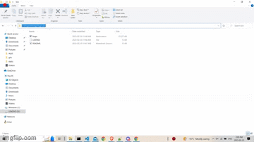
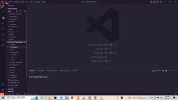
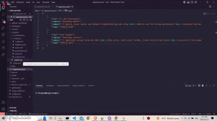
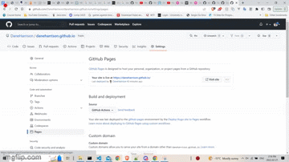
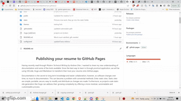

<div align="center">
<h1>Publishing your resume to GitHub</h1>

</div>

Having recently read through *Modern Technical Writing by Andrew Etter*, I wanted to share my new understanding of documentation and the tools available. Since the best way to learn is through *practical application*, we will be using VSCode, Hugo and Markdown on Windows to host your resume on GitHub Pages. 

Documentation is essential for long term knowledge and streamlined collaboration, however, as products change, so must their documentation. This can become problematic with traditional methods. Enter static sites. Static sites are portable, secure, easy to modify and distribute online as changes are made. Additionally, as projects scale static site generators like Hugo can address growing complexities by offering more modular, scriptable and customizable processes. 

<br>

These notes carefully consider Etter's suggested practices: 
- Basic functional documentation
- Explorative nature of documentation
- Careful consideration of peoples time and inclusion of code examples
- The role of modern technology

If you wish to contribute, all suggestion are welcome by [pull request](https://github.com/DaneHarrison/daneharrison.github.io/pulls).


<br>

## Requirements
- Knowledge of basic command line manipulation
- Knowledge and access to VSCode
- Knowledge of Markdown
- Access to Git
- A GitHub account
- A resume

<br>

## Overview
[Setting up your environment](#setting-up-your-environment)
- [Creating your repository](#creating-your-repository)
- [Connecting VSCode to your GitHub](#connecting-vscode-to-your-github)
- [Configuring Hugo](#configuring-hugo)

[Creating your new resume](#creating-your-new-resume)
- [Hugo setup script](#hugo-setup-script)
- [Loading the Hugo-Resume theme](#loading-the-hugo-resume-theme)
- [Making changes](#making-changes)

[Deployment](#deployment)
- [Finishing touches](#finishing-touches)
- [Commiting changes](#commiting-changes)
- [GitHub Actions](#github-actions)

[Results](#results)

<br>

[Appendix](#appendix)
- [Authors and acknowledgments](#authors-and-acknowledgments)
- [More Resources](#more-resources)
- [FAQs](#faqs)


<br>
<br>

# Instructions:
## Setting up your environment
<br>

### Creating your repository
1. Create a new repository from the respoistories tab on your GitHub account

2. Name it **GitHubName**.github.io, note that **GitHubName** should be replaced by whatever yours may be

3. Select the public visibility option

4. Click "Create Repository"

### Connecting VSCode to your GitHub
5. Copy the HTTPS link provided in the blue Quick Setup box after creating the repository

6. Open VSCode and a terminal

7. Navigate to a directory to store your code

8. Type the following into the command line: git clone **link**, note that **link** should be replaced by the content we copied in *step 5*

### Configuring Hugo
9. Naviage [here](https://go.dev/doc/install), although we will not need this resource, by clicking on download, the name of the file infroms us of our computer's architecture

10. Navigate [here](https://github.com/gohugoio/hugo/releases) to find the most recent release of Hugo under *assets*. The release we choose will match your computer's operating system and architecture, which we discovered in *step 9*

11. Copy the path of wherever the downloaded and extracted content is on your system

12. Search up environment variables on your computer

13. Add the path we copied in *step 11* to your environments path



14. Close and reopen VSCode and all active terminals

15. Confirm hugo now works on your system by entering the following into any command line: hugo version

<br>
<br>

## Creating your new resume
<br>

### Hugo setup script
16. Open up your project folder in VSCode and a terminal

17. Run the command: hugo new site **name**, where **name** will later be given to the static site we are creating.

### Loading the Hugo-Resume theme
18. Navigate to the themes folder in VSCodes command line

19. Run the command: git clone https://github.com/OGGampy/hugo-resume

20. Create a new file at the top level of the project folder called .gitmodules

21. Paste the following code snippet inside of the newly created .gitmodules:     
   
```  
   [submodule "path_to_submodule"] 
       path = themes/hugo-resume
       url = https://github.com/OGGampy/hugo-resume
```
### Making changes
22. Convert your resume into Markdown

23. Copy the theme's content folder and paste it in your own. Do not forget to collapse the theme folder affterwards to prevent potential mixup



24. Modify the projects config.toml, note that changes required beyond pasting the contents below will be marked by ***:
```
title = "***your name here"
theme = "hugo-resume"
baseURL = ""
languageCode = "en-us"
PygmentsCodeFences = false
PygmentsCodeFencesGuessSyntax = true
PygmentsStyle = "monokai"
enableGitInfo = false

[params]
address = "***Winnipeg, MB"
email = "***"
favicon = ""
firstName = "***Dane"
lastName = "***Wanke"
phone = ""
profileImage = ""
showEducation = false
showExperience = true
showOpenSource = false
showProjects = true
showPublications = false
showQr = false
showSkills = false

[params.google]

[params.google.analytics]
trackerID = ""

[[params.handles]]
link = "***https://www.linkedin.com/in/dane-wanke-b22b44250/"
name = "LinkedIn"

[[params.handles]]
link = "***https://github.com/DaneHarrison"
name = "GitHub"

[outputs]
home = ["HTML", "JSON"]

[taxonomies]
tag = "tags"
```
25. Add experience.json into the data folder 

26. Format the file as follows:
```
[
    {
        "role": "your role",
        "company": "the company",
        "summary": "the summary with \n\n to distinguish new lines",
        "range": "range of time you worked there for"
    },
    ... for all experiences you would like to include
]

```
27. Edit the project folders _index.md to contain your personal information from your Markdown resume

28. Delete all the files in the contribution folder **except _index.md**

29. Adjust and rename the Markdown files in the creations folder so there is a Markdown file for every project you plan to add **in addition to _index.md**

30. Modify the Markdown files from *steps 29* as follows:
```
{
    "title": "your projects name",
    "featured": true,

    "description": "A description of your project.",

    "image": "images go into the static folder, they can be linked as such: fileName.extension",
    "link": "link to your project",
    "tags": ["meaningful", "tags"]
}


Copy paste the same description given above.
```


31. Run the command: hugo server

<br>
<br>

## Deployment
<br>

### Finishing touches
32. Verify your content, note confidential information may be difficult to remove once posted

33. Change baseURL inside of config.toml to your GitHub repositories link. **Note that this change will needs to be reverted to rerun hugo's development server used in *step 31***

### Commiting changes
34. Commit your changes with a meaningful message

35. Push to your repository

### GitHub Actions
36. Scroll down and select the GitHub Actions deployment method for GitHub Pages

37. Select and commit the boilerplate Hugo script to your repository



38. Navigate to the Actions tab

39. Click on the script created in *step 37* displayed on the left hand side 

40. Click on run workflow in the blue box

<br>
<br>

## Results
### https://daneharrison.github.io/

<br>
<br>
<br>

# Appendix

## Authors and Acknowledgments
Andrew Etter was inspiration for creating this tutorial that relied on Eddie Webbinaro's Hugo-Resume theme. I also wanted to thank Frieda Bi, Hamdi Elzard and Dirk Page for their time and feedback.


<br>

## More Resources
- [VSCode tutorial](https://code.visualstudio.com/docs)
- [Command line tutorial](https://www.freecodecamp.org/news/command-line-for-beginners/)
- [Markdown tutorial](https://www.markdowntutorial.com/)
- [Hugo documentation](https://gohugo.io/documentation/)
- [Hugo themes](https://themes.gohugo.io/)
- [What is a pull request?](https://docs.github.com/en/pull-requests/collaborating-with-pull-requests/proposing-changes-to-your-work-with-pull-requests/about-pull-requests)
- [Technical Writting by Andrew Etter](https://www.amazon.ca/Modern-Technical-Writing-Introduction-Documentation-ebook/dp/B01A2QL9SS)
- [Eddie Webbinaro's GitHub](https://github.com/eddiewebb)

<br>

## FAQs
### 1. Why is Markdown better than a word processor?

There are many strengths in choosing Markdown over a word processor for writting docuemntation. While PDFs are universal they cannot be modified and files that are application specific have difficulties with version control. Version control is a necessity that allows easier modification and distribution of documentation. Therefore, it makes more sense to use Markdown which is simple to use, well supported and integrates web technologies like HTML and CSS for familiar customizability.

<br>

### 2. Does my GitHub repository need to use this particular naming convention?

For this tutorial, yes, a repository that is set to **GitHubName**.github.io automatically enables GitHub pages. Although more importantly, the theme used in this tutorial modifies the sites URL. Therefore, using anything else may break links within your resume.